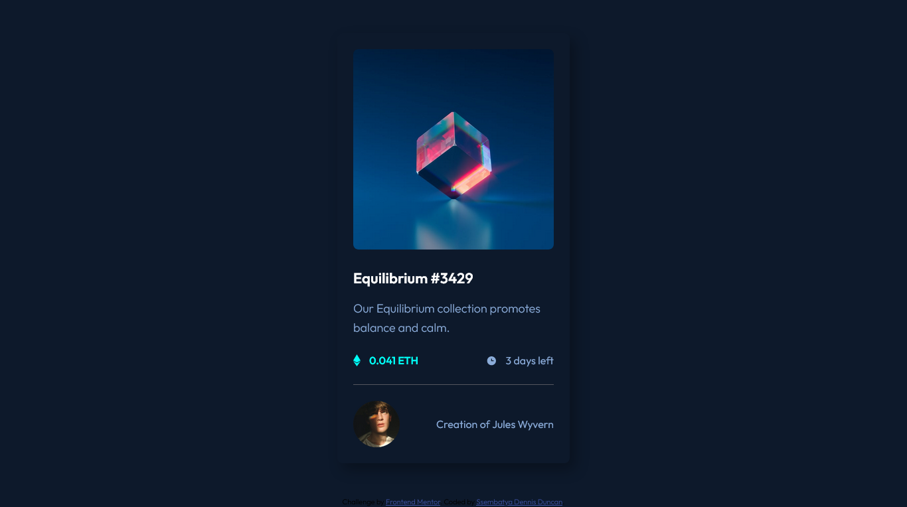

# Frontend Mentor - NFT preview card component solution

This is a solution to the [NFT preview card component challenge on Frontend Mentor](https://www.frontendmentor.io/challenges/nft-preview-card-component-SbdUL_w0U). Frontend Mentor challenges help you improve your coding skills by building realistic projects.

## Overview

The NFT preview card component challenge on Frontend Mentor is a very beautiful component good for someone whose now comfortable with HTML & CSS and you want use more sematics in your HTML and practise better responsive Design CSS practices.

### The challenge

Users should be able to:

- View the optimal layout depending on their device's screen size
- See hover states for interactive elements

### Screenshot

### Links

- Solution URL: [NFT preview card component challenge on Frontend Mentor](https://www.frontendmentor.io/challenges/nft-preview-card-component-SbdUL_w0U/hub/responsive-card-component-using-flexbox-eBcFPfbDK-)
- Live Site URL: [NFT preview card component challenge #live](https://nft-preview-card-component-6q7d.vercel.app/)

### Built with

- Semantic HTML5 markup
- CSS custom properties
- Flexbox
- Mobile-first workflow

### What I learned

I learnt five best ways to overlay content on top of an image and the advanced hover styles

## Author

- Frontend Mentor - [@ssembatya-dennis](https://www.frontendmentor.io/profile/ssembatya-dennis)
- Twitter - [@DennisSsembatya](https://twitter.com/DennisSsembatya)
